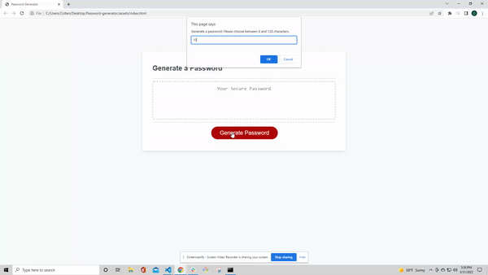

# Password-generator

## Description

The purose of this project is to randomly and automatically generate a unique password when the generate password button is clicked. The browser will send an alert to generate a password once you have clicked the button. The user will then be prompted to confirm the amount of characters you desire- between 8-128. It will then bring you through a series of confirmations to see if you would like uppercase characters, lowercase letters, special characters, and numbers. You must confirm at least one to continue to generate a password. The password generated will automatically come up with the unqique password with the desired length and character types given after all the confirmations are done. Reference GIF below to see the functionality of the webpage.

### Lessons Learned

There is a lot of great takeaways from the project completed using Javascript. First and foremost, it is crucial to start out with a plan. Commenting through sections is crucial to understand the plan from start to finish and will help the code be more manageable as you dive into the making of the webpage. The second takeaway is to have very clear variable descriptions for their set given purposes. If they are not cledar enough, it will be hard to maintain where they are intended to be used for. Another lesson learned is to test the coded frequently to see what works and what doesn't as well as just having a visual representation of where you are at. Last but not least,  it is incredibly helpful to tackle projects in set chunks. Working in chunks of the project made my code feel cleaner since I was tackling a given portion at once and had fresh thoughts on my intentions for things and was able to go around understanding the use of everything.

### Languages Used

HTML
CSS
Javascript

### Authors

Kylie Shinn

* LinkedIn [LinkedIn](https://www.linkedin.com/in/kylie-shinn-18b0301b7/)
* Github [Github]https://github.com/kyliemshinn

### License

MIT License

Copyright (c) [2022] [Kylie]

Permission is hereby granted, free of charge, to any person obtaining a copy
of this software and associated documentation files (the "Software"), to deal
in the Software without restriction, including without limitation the rights
to use, copy, modify, merge, publish, distribute, sublicense, and/or sell
copies of the Software, and to permit persons to whom the Software is
furnished to do so, subject to the following conditions:

The above copyright notice and this permission notice shall be included in all
copies or substantial portions of the Software.

THE SOFTWARE IS PROVIDED "AS IS", WITHOUT WARRANTY OF ANY KIND, EXPRESS OR
IMPLIED, INCLUDING BUT NOT LIMITED TO THE WARRANTIES OF MERCHANTABILITY,
FITNESS FOR A PARTICULAR PURPOSE AND NONINFRINGEMENT. IN NO EVENT SHALL THE
AUTHORS OR COPYRIGHT HOLDERS BE LIABLE FOR ANY CLAIM, DAMAGES OR OTHER
LIABILITY, WHETHER IN AN ACTION OF CONTRACT, TORT OR OTHERWISE, ARISING FROM,
OUT OF OR IN CONNECTION WITH THE SOFTWARE OR THE USE OR OTHER DEALINGS IN THE
SOFTWARE.